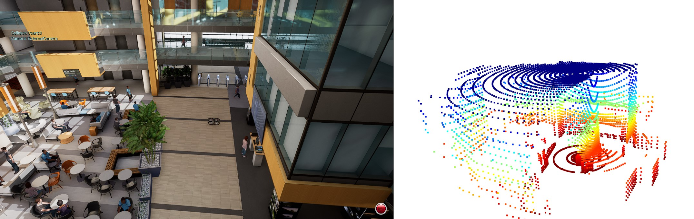
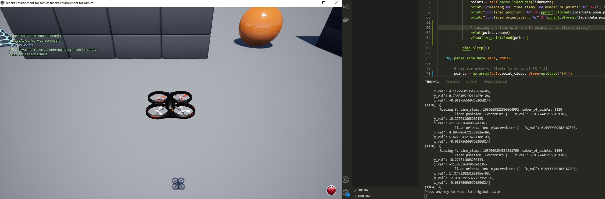

# PhysCov - Quantifying Physical Coverage for Autonomous Drones (Microsoft AirSim)
Thorough testing of autonomous systems for UAVs before their deployment is crucial to guarantee safety and mitigate costly failures. Existing software testing coverage metrics lack interpretability and these test adequacy metrics are not effective for complex AI driven autonomous vehicles. We scale PhysCov, a physical coverage metric created by Carl Hildebrandt (PhD Computer Science, UVA LESS Lab) for autonomous vehicles, to the domain of UAVs - to measure coverage on a Software-In-The-Loop simulation tool like Microsoft AirSim.

Along with integration for real-time coverage measurements, we test various scenarios in AirSim using a quadrotor equipped with a LIDAR sensor under certain defined survey tasks. Based on our evaluation, we propose that gathering high coverage with PhysCov indicates testing of an adequate number of distinct behaviors for an autonomous flying system, uncovering potential failures such as collisions.

You can read the full project report [here](Report.pdf).



## Dependencies
1. Install [Python](https://www.python.org/downloads/). Preferably v3.8, if you would like to use Open3D for pointcloud visualization during RSR generation.
2. Install the following packages: 
```
pip install numpy
pip install msgpack-rpc-python
pip install -r requirements.txt
```
Some of these initial dependencies were made to install separately given they conflict with other requirements later.

## Setup an AirSim Environment

1. Download any environment from the link below, for example, Blocks.zip. Extract and run the .exe
https://github.com/Microsoft/AirSim/releases


2. Place the settings.json file in Documents/AirSim **OR** run the following command with the executable of your environment:

```
.\Blocks\WindowsNoEditor\Blocks.exe --settings settings.json
```

You can press F1 to view more help information inside the simulation tool. 
Please go over the instructions to use AirSim at https://microsoft.github.io/AirSim/#how-to-use-it

### Hardware Requirements
AirSim is built on Unreal Engine and can be hardware intensive ([FAQs](https://microsoft.github.io/AirSim/faq/)) - the system requires at least 4GB of RAM (8GB recommended) and an integrated/external GPU with atleast 4GB of VRAM. To obtain the best performance without a dedicated GPU, please use the Blocks environment provided by AirSim as this has a minimal hardware footprint.

## Choose a Control Mode
Choose from the following two modes currently:

### Manual
Manual control using an [Xbox controller](https://microsoft.github.io/AirSim/xbox_controller/) connected to your computer. 

Other alternatives including programmatic controls such as pre-defined survey paths using the AirSim Python API, or setting up configuration for a PX4 controller in AirSim which we have not tested. More instructions regarding these procedures can be found at https://microsoft.github.io/AirSim/#how-to-use-it.

### Playback 
This involves replaying a recorded path (autonomous playback mode) from the last recorded manual session - saved as `recordedpath.npy` (which includes 3D coordinates traversed at captured timepoints). 

**Note:** The recorded path provided inside the repository was recorded over the Blocks.exe environment. To test this mode out, setup that environment and simply run the script with autonomous playback mode set.

## Start real-time PhysCov generation

Once the installed Airsim environment binary (e.g. Blocks.exe) is running, simply execute the main script:
```python src/physcov_airsim_drone.py```

The script will initiate drone take-off using the pre-defined default parameters and on a separate thread perform RSR generation and PhysCov computations while the drone flies. After execution, plots for the runs are also saved in the same folder including plots for:
- PhysCov over time
- Number of unique collisions over time
- Number of unique collision vectors

## Configurable Parameters
- Simulation timesteps for recording (based on and equivalent to number of RSR signatures) **(t = 500)**
- Number of beams/rays **(x = 5)**
- Granularity for beam distance rounding **(g = 2)**
- Drone velocity for playback mode **(v = 6 m/s)**
- Max reachable range for one timepoint **(R = 6 m)** 
- Radius of sphere for sphere-casting collision detection of RSR beams **(r = 1m)**

**BufferError?** - If you get a BufferError such as "Existing exports of data: object cannot be re-sized on the console" - simply reset the drone using backspace and re-run the script.


